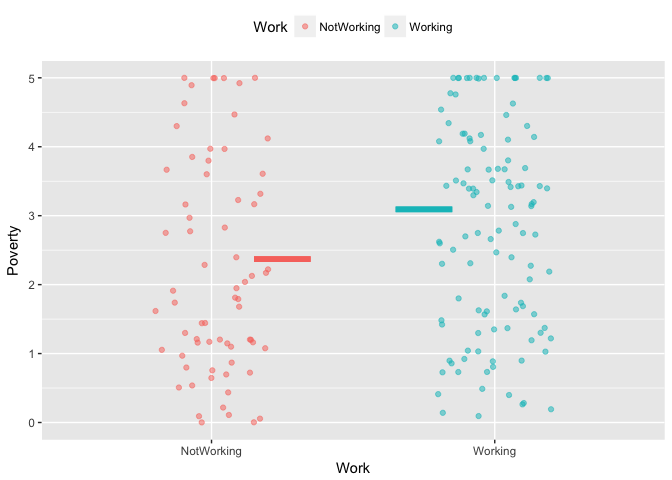
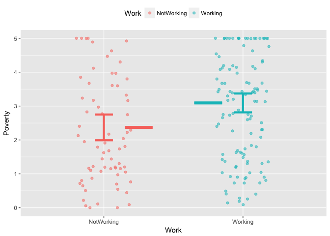
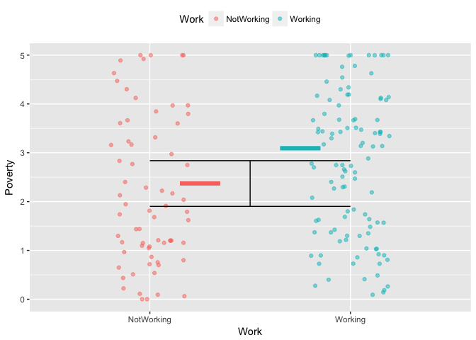

This Little App helps you to explore the the statistics of a difference in means between two groups. The setting is that you have a quantitative response variable and a categorical explanatory variable with two levels. As such, the explanatory variable divides the entire sample into two groups. 

The App is based on the `NHANES` data frame, where the unit-of-observation is an individual person. To illustrate, here is the display from the app when:

* The response variable is `Poverty`. The variable measures household income as a multiple of the official poverty level.
* The explanatory variable is `Working`. This variable has two levels: NotWorking and Working.
* The checkbox to "show means" is checked.
* The sample size is 200, selected at random from the `NHANES` data frame.

You can see that the mean value of `Poverty` for the NonWorking group is somewhat lower than for the Working group, at least in this particular random sample of $n = 200$.

The statistical question is whether the difference between the two groups' means reflects a systematic trend in the population from which the `NHANES` data were collected, or is just the result of the process of random sampling. 

In the app, an easy way to address the statistical question is to draw another sample and check whether the groupwise means show the same pattern in that new sample. Do this many times. If the same pattern is seen in the large majority of sample trials -- say 95 out of 100 -- you have good reason to believe that the NHANES population itself has this pattern.

On the computer, it's easy to generate as many sampling trials as you like. In the real world, however, this is not a practical option. As a result, statisticians have had to discover ways to judge, from a single sample trial, whether there's good reason to think that the population has the same pattern shown in the trial.

One way to do this involves calculating a 95% confidence interval for each of the two means. In the App, you can display this with:

* the checkbox labeled "Show conf. intervals"

Here, you can see that the two confidence intervals barely overlap. That's a good indication that the difference between the two means genuinely reflects a similar difference in the NHANES population. The overlap (or not) in the two confidence intervals is a kind of *test* of whether the two means are different in the NHANES population.

The *t test* is a more formal way of testing whether a difference in means observed in a sample is large enough to warrant the conclusion that there is a similar difference for the whole population. The results of the t-test are pretty much the same as you would get looking for overlap in the confidence intervals. 

A t-statistic is a way of measuring "distance." In this Little App, the "distance" is the minimum amount by which the groupwise means would have to differ to warrant a conclusion that there is a similar difference in the population means. Display this using

* checkbox labeled "show t interval"

The black, sideways-H shaped interval shows the result of the t calculations. The interval is being drawn exactly centered (vertically) on one of the groupwise means. (It doesn't matter which.) If the other groupwise mean falls outside of the interval, then the difference between the groupwise means is large enough to justify a conclusion that the population means also differ.

