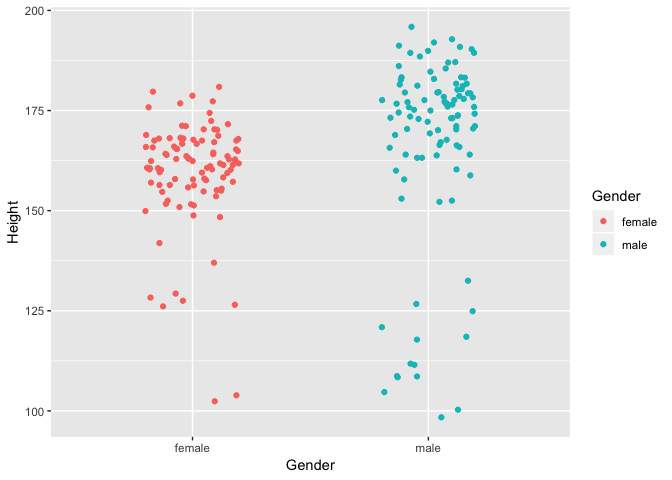

These are the main R commands used in this Little App.

### Preliminary: data and sampling process

The data used in the app are given by the `NHANES` data frame in the `NHANES` package. If you're using another data frame in your commands, substitute the name of that for `NHANES`.

#### Sampling

In the app, the data being displayed at any time are a random sample drawn from `NHANES`. These can be generated with a command like this:

```r
My_sample <- NHANES %>%
  sample_n(size = 100)
```

Do keep in mind that such a sub-sampling of a data frame is done only for demonstration purposes in the app, to allow the user to explore the impact of sample size on the calculation. Usually, in data analysis, the entire data frame is used in the calculations.

For *stratified sampling*, insert an intermediate command to cause the random sampling to be done in each group defined by a categorical variable. For instance, the following will sample 200 cases, 100 each for males and females.

```r
My_sample <- NHANES %>%
  group_by(Gender) %>%
  sample_n(size = 100)
```

If you want to guarantee that there are no missing values in your sample (as, for instance, for a demonstration), use `select()` to pick out the variables of interest and `omit.na()` to delete cases with missing values before sampling:


```r
My_sample <- NHANES %>%
  select(Gender, Height) %>%
  na.omit() %>%
  group_by(Gender) %>% # does the stratification
  sample_n(size = 100)
```

#### Data Graphics

The App's display of the data themselves is in the form of a *jittered* scatterplot:

```r
gf_jitter(Height ~ Gender, data = My_sample, color = ~ Gender,
          width = 0.2, height = 0, seed = 12345)
```



The `width = 0.2` means that the extent of the horizontal jittering should be 20% of the way to the neighboring group. `height = 0` means not to do any vertical jittering.

### Groupwise means and confidence intervals


```r
df_stats(Height ~ Gender, data = My_sample, mean, ci.mean)
```

```
##   Gender mean_Height    lower    upper
## 1 female     159.564 156.8949 162.2331
## 2   male     167.074 162.3876 171.7604
```

### The t statistic

The calculations of t can be done with the `t.test()` function:

```r
t.test(Height ~ Gender, data = My_sample)
```

```
## 
## 	Welch Two Sample t-test
## 
## data:  Height by Gender
## t = -2.763, df = 157.11, p-value = 0.006411
## alternative hypothesis: true difference in means is not equal to 0
## 95 percent confidence interval:
##  -12.878604  -2.141396
## sample estimates:
## mean in group female   mean in group male 
##              159.564              167.074
```

The sideways H-shaped interval displayed by the app is based on the 95% confidence interval. The bottom and top of the displayed interval are given by adding the two numbers calculated to the *second* of the group means.

### Recommendation: Use regression instead of `t.test()`

For situations where the sample size n is greater than, say, 10, the calculations done by `t.test()` (particularly the degrees of freedom, which don't have to be an integer) are *overkill* and ignore a much more important issue: the existence of covariates. For the sake of simplicity, interpretability, and consistency, you can fold the t-test into the more general framework of linear regression:


```r
model <- lm(Height ~ Gender, data = My_sample)
summary(model)
```

```
## 
## Call:
## lm(formula = Height ~ Gender, data = My_sample)
## 
## Residuals:
##     Min      1Q  Median      3Q     Max 
## -68.674  -3.164   4.186  10.553  28.826 
## 
## Coefficients:
##             Estimate Std. Error t value Pr(>|t|)    
## (Intercept)  159.564      1.922  83.022  < 2e-16 ***
## Gendermale     7.510      2.718   2.763  0.00627 ** 
## ---
## Signif. codes:  0 '***' 0.001 '**' 0.01 '*' 0.05 '.' 0.1 ' ' 1
## 
## Residual standard error: 19.22 on 198 degrees of freedom
## Multiple R-squared:  0.03713,	Adjusted R-squared:  0.03226 
## F-statistic: 7.634 on 1 and 198 DF,  p-value: 0.006267
```

The regression report is formatted differently than the t-test report. The "estimate" (or "coefficient") on `Gendermale` gives the *difference* in means between the two groups. A 95% confidence interval on that difference will be constructed with ± 2 times the standard error. Note that the p-value on the difference between males and females in the regression report is effectively the same as that reported from the t-test. The very slight numerical difference would disappear entirely if the t-test had been conducted using equal variances for the two groups, which you can impose using the argument `var.equal = TRUE` when calling `t.test()`.

There's not any practical reason to prefer the unequal variance t-test, particularly in an undergraduate statistics course. The unequal t-test by and large has only negligibly greater power even in extreme cases of unequal variances. Much more importantly, the inability of a t-test to deal with covariates means that t-test-like calculations are (and should be) routinely done with regression anyways. Leaving out a suspected covariate can lead to huge bias, much larger than the adjustment to t that results from assuming unequal variance.
